# HOLO-RTLS — System Architecture Diagrams

> Copy and paste any diagram block into [Mermaid Live Editor](https://mermaid.live) to render.
> All diagrams use Mermaid 10.x syntax.

---

## 1. High-Level System Architecture

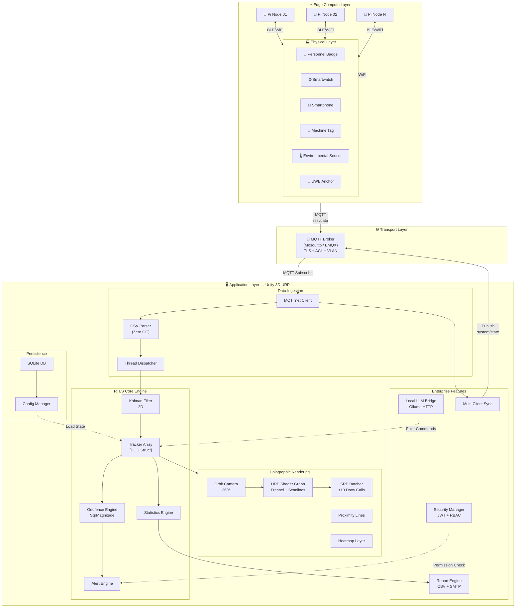

---

## 2. Data Flow — Message Pipeline

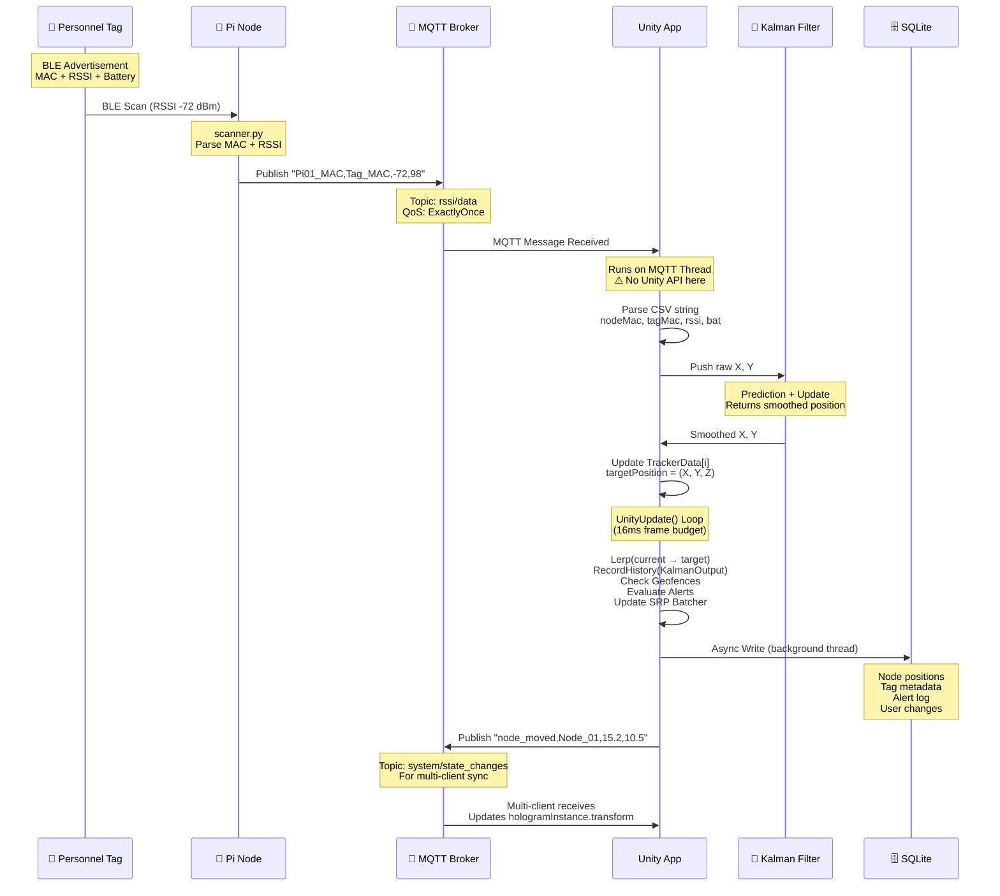

---

## 3. Kalman Filter — Mathematical Flow

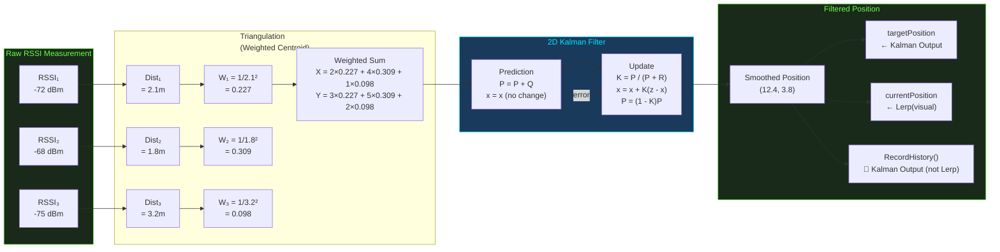

---

## 4. Geofence Engine — Collision Detection

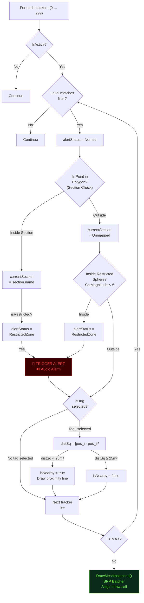

---

## 5. Multi-Client State Synchronization

```mermaid
sequenceDiagram
    participant PC_A as 🖥️ Operator A<br/>(Admin)
    participant PC_B as 🖥️ Operator B<br/>(Security)
    participant PC_C as 🖥️ Operator C<br/>(Viewer)
    participant BRK as 📡 MQTT Broker

    Note over PC_A,PC_C: All clients subscribe to system/state_changes

    PC_A->>PC_A: User drags Node_01 to new position
    PC_A->>PC_A: Update local hologramInstance.transform
    PC_A->>PC_A: Update nodes[i].mapPosition in struct
    PC_A->>BRK: Publish "node_moved,Node_01,15.2,10.5"
    Note over BRK: Topic: system/state_changes<br/>FromClientID: PC_A

    BRK-->>PC_B: Deliver message
    BRK-->>PC_C: Deliver message
    BRK-->>PC_A: Deliver to self (echo)

    rect rgb(20, 40, 20)
        Note over PC_B: PC B receives node_moved
        PC_B->>PC_B: Parse: Node_01, 15.2, 10.5
        PC_B->>PC_B: Find nodes["Node_01"]
        PC_B->>PC_B: Update nodes[i].mapPosition
        PC_B->>PC_B: Update hologramInstance.transform
        Note over PC_B: ✅ Map instantly synced
    end

    rect rgb(20, 40, 20)
        Note over PC_C: PC C receives node_moved
        PC_C->>PC_C: Parse: Node_01, 15.2, 10.5
        PC_C->>PC_C: Update nodes[i].mapPosition
        PC_C->>PC_C: Update hologramInstance.transform
        Note over PC_C: ✅ Map instantly synced
    end
```

---

## 6. LLM Integration Flow

```mermaid
flowchart TB
    START["👤 User types in AI chat:\n'Show all low battery in Sector 4'"] --> SANITIZE

    subgraph SANITIZE["Input Sanitization"]
        S1["Strip code blocks\n``` → remove"]
        S2["Strip markdown links\n[text](url) → remove"]
        S3["Strip SQL injection chars\n'; DROP TABLE → sanitize"]
        S4["Strip prompt injection\n'Ignore previous' → block"]
    end
    SANITIZE --> VALID{"Sanitized?"}
    VALID -->|"Yes"| HTTP
    VALID -->|"No"| REJECT["❌ Discard input\nShow: 'Input not accepted'"]

    HTTP["Unity HTTP Client\nPOST localhost:11434/api/generate"]

    subgraph OLLAMA["Local Ollama Runtime"]
        O1["Load model into VRAM\n(Llama-3 8B or Phi-3)"]
        O2["System Prompt:\n'You are RTLS assistant.\nOutput JSON command only...'"]
        O3["User prompt injected\n'Filter low battery in Sector 4'"]
        O4["Model inference\n(~200ms on RTX 4070)"]
        O5["Raw response:\n{\"action\":\"filter\",\n\"battery\":\"low\",\n\"section\":\"Sector 4\"}"]
    end

    HTTP --> OLLAMA

    subgraph VALIDATE["Output Validation"]
        V1["Parse JSON\n(JsonUtility)"]
        V2{"Matches\nLlmCommand\nschema?"}
        V3["✅ Valid\nExtract action,\nfilters, params"]
        V4["❌ Invalid\nDiscard response\nLog to audit"]
    end

    O5 --> VALIDATE
    V1 --> V2
    V2 -->|"Match"| V3
    V2 -->|"No match"| V4

    V3 --> EXEC["Execute filtered command\nApply UI highlight\nZoom map to results"]
    V4 --> ERROR["Show: 'I couldn't\nunderstand that. Try:\nShow tags with...'"]
    EXEC --> DISPLAY["🤖 AI responds:\n'Filtered 12 tags with\nlow battery in Sector 4.\nMap has been updated.'"]

    style SANITIZE fill:#2a1a00,color:#ffb300,stroke:#ffb300
    style VALIDATE fill:#1a2a3a,color:#00e5ff,stroke:#00e5ff
    style OLLAMA fill:#1a2a1a,color:#69ff47,stroke:#69ff47
    style REJECT fill:#3d0000,color:#ff4444,stroke:#ff4444
```

---

## 7. RBAC — Role Permission Matrix

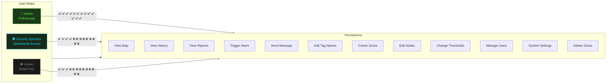

---

## 8. Alert State Machine

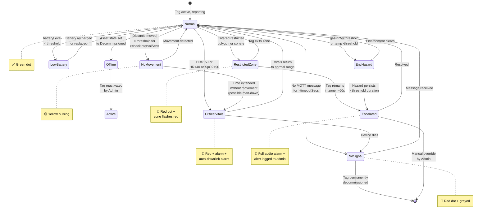

---

## 9. Database Entity Relationship

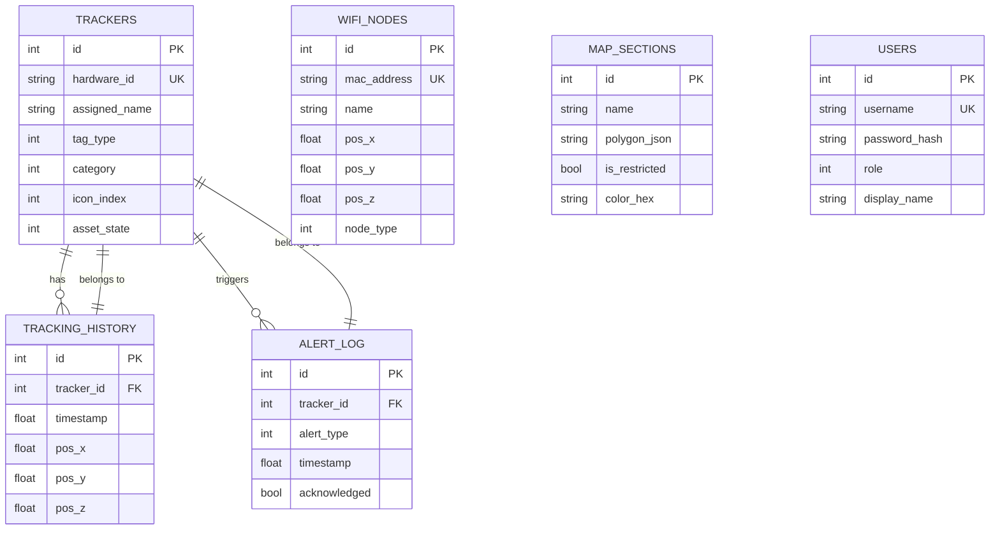

---

## 10. 2D vs 3D View Architecture

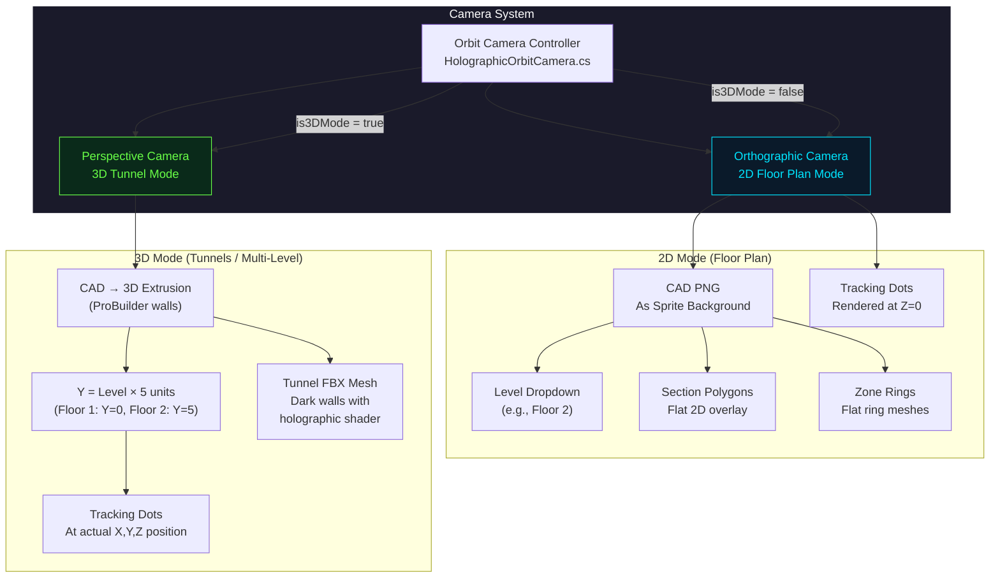

---

## 11. History Circular Buffer

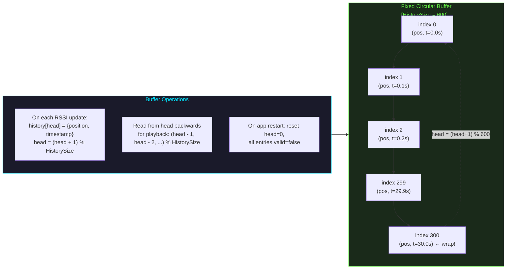

---

## 12. Network Topology — VLAN Isolation

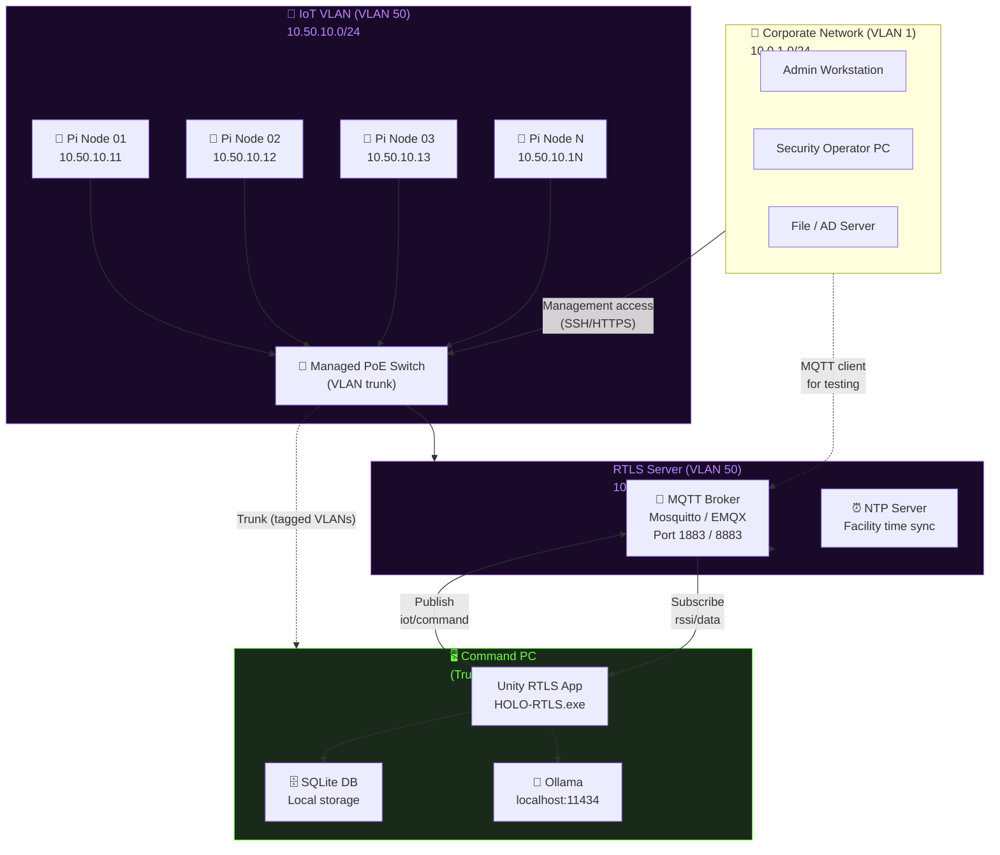

---

## 13. Sprint / Phase Timeline (Gantt)

```mermaid
gantt
    title HOLO-RTLS Development Roadmap — 12 Weeks
    dateFormat  YYYY-MM-DD

    section Phase 0
    Pre-Dev Setup                    :done, p0_1, 2026-07-20, 7d
    Hardware Procurement             :done, p0_2, 2026-07-20, 14d

    section Phase 1
    Week 1: DOD Core + Rendering     :active, p1_1, 2026-07-27, 7d
    Week 2: Coord Mapping + 2D/3D     :p1_2, 2026-08-03, 7d

    section Phase 2
    Week 3: MQTT + Kalman             :p2_1, 2026-08-10, 7d
    Week 4: SQLite + Node Calib      :p2_2, 2026-08-17, 7d

    section Phase 3
    Week 5: Geofencing + Alerts       :p3_1, 2026-08-24, 7d
    Week 6: Downlink + Proximity      :p3_2, 2026-08-31, 7d

    section Phase 4
    Week 7: Enterprise UI             :p4_1, 2026-09-07, 7d
    Week 8: LLM + RBAC                :p4_2, 2026-09-14, 7d

    section Phase 5
    Week 9: History + Heatmaps        :p5_1, 2026-09-21, 7d
    Week 10: Reports + Email          :p5_2, 2026-09-28, 7d

    section Phase 6
    Week 11: Load Testing             :p6_1, 2026-10-05, 7d
    Week 12: Release + Docs           :p6_2, 2026-10-12, 7d

    section Milestones
    M1: Foundation                    :milestone, m1, 2026-08-10, 0d
    M2: Networked                     :milestone, m2, 2026-08-24, 0d
    M3: Intelligent                   :milestone, m3, 2026-09-07, 0d
    M4: Command Center                :milestone, m4, 2026-09-21, 0d
    M5: Analytics                     :milestone, m5, 2026-10-05, 0d
    M6: Production                     :milestone, m6, 2026-10-19, 0d
```

---

*Diagrams v1.0 — HOLO-RTLS — 2026-07-17*
*Render with Mermaid Live Editor: https://mermaid.live*
