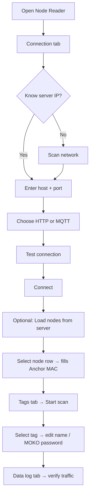

# Node Reader — design & admin guide

## Your proposed UI (review)

Your layout is **solid** and matches how field engineers commission RTLS systems:

| Screen | Your idea | Status in v1 app |
|--------|-----------|------------------|
| Node scan / pick | Scan network + load nodes from server | ✅ Implemented |
| Server host field | Manual IP/hostname | ✅ |
| Port selector | HTTP + MQTT ports | ✅ |
| HTTP vs MQTT | Transport toggle | ✅ |
| Connect / Disconnect | With status indicator | ✅ |
| Tag scanner | Start/stop BLE scan | ✅ |
| Tag table | All detected devices | ✅ |
| Tag settings panel | Select row → edit | ✅ + MOKO password |
| Data log page | MQTT/HTTP in/out | ✅ + BLE filter |

## Important clarifications

### Two different “passwords”

| Password | Used for | Where |
|----------|----------|-------|
| **Scanner API key** | Node → server authentication | Server `.env` + Node Reader Connection tab |
| **Admin email/password** | Load node list from server | Node Reader only (optional) |
| **MOKO tag password** | Configure tag over BLE (BeaconX Pro) | Tag settings panel — **not** server login |

### “WiFi node scan” on a PC

On a **PC**, the app cannot scan other Pi gateways over WiFi directly. Instead:

1. **Scan network** — finds HOLO-RTLS **servers** on port 5000
2. **Load nodes from server** — fetches registered `WifiNode` list (requires admin login)
3. **This PC is the test node** — its Bluetooth adapter scans tags; Anchor MAC identifies it to the server

Physical Pi/ESP32 nodes run `scanner/main.py` or MQTT firmware separately.

### MQTT vs HTTP (mixed fleet)

| Node type | Transport | Port | Topic / endpoint |
|-----------|-----------|------|------------------|
| Raspberry Pi / PC reader | **HTTP** | 5000 | `POST /api/scanner/detections` |
| ESP32 BLE gateway | **MQTT** | 1883 / 8883 | Publish `rssi/data` |
| HOLO-RTLS server (outbound) | MQTT | 1883 | Subscribe `rtls/state_changes` |

Admin configures **both** on the server; each node uses one transport.

---

## Suggested additions (you may be missing)

### High priority (commissioning)

1. **Connection health** — last ping time, packets sent/failed (partially: status bar + data log)
2. **Bluetooth adapter status** — “BT OFF” warning before scan
3. **Test connection** before Connect — ✅ included
4. **Anchor MAC auto-detect** — ✅ PC MAC suggested
5. **Last seen / age column** on tag table — shows stale devices
6. **RSSI threshold slider** — ignore weak signals (phones far away)
7. **Register this PC as node on server** — one-click after login (future)

### Medium priority (operations)

8. **Saved connection profiles** — “Site A”, “Lab”, etc.
9. **Auto-reconnect** when server drops
10. **Export tag list** CSV (MAC, name, RSSI, type)
11. **TX power calibration wizard** — place tag at 1 m, measure RSSI
12. **Heartbeat** — node publishes `node/heartbeat` so dashboard shows online

### MOKO-specific

13. **Tag password field** — ✅ stored locally per MAC
14. **Connect to tag via BLE GATT** — read device info / apply settings (needs MOKO GATT protocol; v2)
15. **Link to BeaconX Pro** — “Open manufacturer app for DFU/slots” help text

### Security

16. **Do not store admin password** in plain text long-term — v1 stores for convenience; use OS keyring in v2
17. **TLS for HTTP** — if server uses HTTPS
18. **MQTT username/password fields** — add to Connection tab for production brokers

### Positioning context

19. **Reminder: ≥3 nodes needed** for map position — single PC test only proves tag is heard
20. **Acknowledge tag in web UI** — after discovery, admin assigns tag in Trackers page

---

## Recommended screen flow

---

## Admin checklist (mixed HTTP + MQTT site)

1. Install MQTT broker (Mosquitto) if using ESP32 nodes
2. Set server `.env`: `SCANNER_API_KEY`, `MQTT_BROKER_HOST`, `MQTT_BROKER_PORT`
3. Dashboard → **Anchors**: create all nodes with MAC + map position
4. Deploy Pi nodes: `scanner/main.py` with matching `SCANNER_API_KEY`
5. Deploy ESP32: flash gateway firmware, topic `rssi/data`
6. PC commissioning: run **Node Reader**, connect HTTP, scan tags, verify data log
7. Dashboard → **Trackers**: run discovery scan, acknowledge MOKO tags
8. Calibrate anchor TX power for accurate RSSI positioning

---

## Related files

| File | Role |
|------|------|
| `node_reader/app.py` | Desktop GUI |
| `node_reader/transport.py` | HTTP + MQTT clients |
| `node_reader/ble_engine.py` | BLE scanning |
| `scanner/main.py` | Production Pi daemon |
| `backend/api/scanner/__init__.py` | Detection ingest API |
| `docs/HARDWARE.md` | Hardware profiles |
