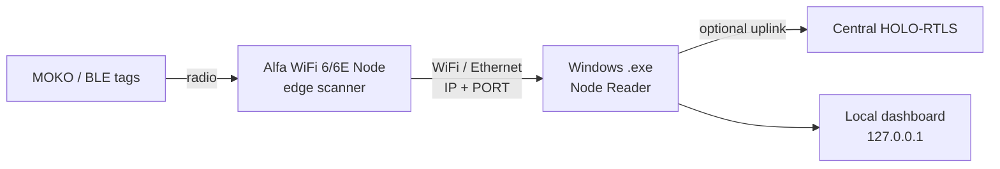

# HOLO-RTLS Node Reader — Windows Plan (v3 — BlueApro 6/6E)

> **Device:** BlueApro WiFi 6/6E (e.g. S/N `261FBLUEAO004`), **vendor firmware** (BlueUp TinyGateway family).  
> **Default link:** HTTP to node. **Port:** user-selectable in PC app (default 80).  
> **Implemented:** `node_reader/` — pull + push modes, `.exe` via PyInstaller.

---

## 1. What changed (v2 → v3)

| Wrong assumption (v2) | Correct model (v3) |
|----------------------|---------------------|
| PC Bluetooth scans tags | **Alfa WiFi node** scans tags (BLE +/or WiFi probes) |
| PC is the only gateway | PC is a **controller / reader** that connects **to** the node |
| Port = local mini-server only | Port = **node service port** (HTTP 5000, MQTT 1883, device API, etc.) |
| Built-in PC WiFi/BT | **External Alfa WiFi 6/6E** device on the network (or USB to PC in advanced mode) |



**Simple words:** Tags talk to the **Alfa box**. The **.exe on Windows** plugs into the Alfa box over the network (you pick IP + port + HTTP or MQTT). The PC does not replace the Alfa — it **controls and reads** it.

---

## 2. What the Alfa WiFi 6/6E node is

Typical deployment (matches HOLO-RTLS `scanner/` on Pi + Alfa):

| Component | Role |
|-----------|------|
| **Alfa USB adapter** (e.g. AWUS036AXML / WiFi 6/6E) | Radio: monitor-mode WiFi probes + often paired with BLE on the same board |
| **Node computer** (Raspberry Pi, industrial gateway, or Alfa firmware) | Runs scanner daemon, publishes detections |
| **Network** | Node gets IP on site WiFi / Ethernet |

The Windows app connects to **the node’s IP address**, not to the USB adapter directly (unless USB is plugged into the same PC — see §8).

---

## 3. Port selection — what each port means

Admin / operator must choose **transport + port** when connecting to the Alfa node:

| Transport | Default port | Direction | Payload |
|-----------|--------------|-----------|---------|
| **HTTP** | `5000` (or node config) | PC → node **or** node → central | `POST /api/scanner/detections` style JSON |
| **MQTT** | `1883` plain / `8883` TLS | Node → broker; PC subscribes or node hosts broker | Topic `rssi/data`: `NodeMAC,TagMAC,RSSI,Battery` |
| **Device web** | `80` / `8080` | PC → node | Status page / vendor API (commissioning) |
| **Local dashboard** | `8765` | PC localhost only | Embedded UI in `.exe` (not the Alfa port) |

**UI fields (Connection tab):**

```
[ Scan WiFi nodes ]     ← discover nodes on LAN

Node IP / hostname: [ 192.168.1.50        ]
Transport:           ( ) HTTP   ( ) MQTT
Port:                [ 5000 ]               ← THIS is the important port
MQTT topic:          [ rssi/data ]        (if MQTT)
TLS:                 [ ] Use 8883

[ Test ]  [ Connect ]  [ Disconnect ]

Status: ● Connected to Alfa-North-01 @ 192.168.1.50:5000
```

---

## 4. App roles (revised)

| Role | Description |
|------|-------------|
| **Node discovery** | Scan LAN for HOLO-RTLS nodes / open ports / mDNS `_holo-scanner._tcp` |
| **Node client** | Connect to selected Alfa node (HTTP pull or MQTT subscribe) |
| **Tag viewer** | Table of tags reported **by the node** (not PC BLE, unless USB mode) |
| **Tag settings** | Name, scan type, MOKO password (stored on PC; sync to central optional) |
| **Data log** | Raw frames: node → PC, PC → central, MQTT in/out |
| **Local mini-server** (optional) | `127.0.0.1:8765` so browser can open dashboard while testing |
| **Uplink** (optional) | Forward same detections to central HOLO-RTLS |

---

## 5. UI plan (aligned with your screens)

### Tab 1 — Connection & node

| Control | Purpose |
|---------|---------|
| **Scan WiFi nodes** | Find Alfa/HOLO nodes on network (IP scan + optional mDNS) |
| **Node list** | Pick node to test (name, IP, MAC, last seen) |
| **Node IP / hostname** | Manual entry if scan fails |
| **Transport** | HTTP or MQTT |
| **Port** | Node service port (5000, 1883, 8883, custom) |
| **MQTT topic / TLS** | When MQTT selected |
| **Connect / Disconnect** | Open session to **Alfa node** |
| **Test** | Ping node health without starting tag stream |
| **Central server (optional)** | Second section: uplink to HOLO-RTLS production server |

### Tab 2 — Tag scanner

| Control | Purpose |
|---------|---------|
| **Start / Stop** | Start receiving tag stream from **connected node** |
| **Tags table** | MAC, name, RSSI, type, last seen, signal (BLE/WiFi) |
| **Select tag** | Edit display name, scan type, **MOKO password**, notes |
| **Refresh** | Pull latest snapshot from node API |

*Note:* “Start scan” tells the **node** to scan (if API supports it) or starts subscribing to its MQTT/HTTP stream.

### Tab 3 — Data log

| Channel | Content |
|---------|---------|
| **← Node** | Raw data from Alfa node (HTTP body / MQTT messages) |
| **→ Central** | Uplink to HOLO-RTLS (if enabled) |
| **← Central** | MQTT `rtls/state_changes`, alarms |
| **Local API** | Embedded mini-server requests |

Filter + export CSV/txt.

---

## 6. How PC connects to Alfa node (protocols)

### Option A — HTTP (recommended for Pi + Alfa scanner)

Node runs `scanner/main.py` or HOLO-RTLS edge agent:

**PC polls or node pushes via WebSocket (phase 2):**

```
GET  http://NODE:5000/api/node/health
GET  http://NODE:5000/api/node/detections/live   ← PC pulls tag list
POST http://NODE:5000/api/node/scan/start        ← PC starts scan on node
```

*If node only pushes to central today:* PC connects to **central** with same scanner key and filters by `anchor_mac` — or we add **edge API on node** (Phase 1 backend task).

### Option B — MQTT

Node publishes:

```
Topic: rssi/data
Payload: AA:BB:CC:DD:EE:01,F9:2F:B6:2C:DE:24,-72,98
```

PC `.exe`:
- Connects to **broker IP + port** (1883/8883)
- Subscribes to `rssi/data` filtered by selected node MAC
- Shows in table + log

Broker may run on: Alfa node, central server, or site gateway.

### Option C — Direct to central (commissioning shortcut)

PC does not talk to Alfa directly; connects to central HOLO-RTLS and views detections from node MAC already registered.  
**Less ideal** for field test but works with zero node firmware changes.

---

## 7. Node discovery (“Scan WiFi nodes” button)

| Method | Implementation |
|--------|----------------|
| **Subnet port scan** | Scan `/24` for open `5000`, `1883`, `8080` |
| **mDNS** | `_holo-rtls-node._tcp.local` (add to edge firmware) |
| **UDP beacon** | Node broadcasts `"HOLO_NODE|IP|MAC|name"` every 5s (add to firmware) |
| **Load from central** | GET `/api/nodes` after admin login |
| **Manual** | Operator types IP |

Discovery result table:

| Name | IP | MAC | Ports open | Transport |
|------|-----|-----|------------|-----------|
| Alfa-North-01 | 192.168.1.50 | DC:A6:32:… | 5000, 1883 | HTTP+MQTT |

User clicks row → fills IP + port fields.

---

## 8. Alfa USB plugged into the same Windows PC (advanced)

Possible but **hard on Windows**:

| Approach | Feasibility |
|----------|-------------|
| Monitor mode + scapy/Npcap | Limited; WiFi 6/6E Alfa often needs Linux |
| Vendor Alfa SDK / driver API | Research per model |
| WSL2 + USB passthrough + Linux scanner | Power users only |

**Recommendation:** Treat **network-connected Alfa node** (Pi + Alfa USB) as primary.  
PC USB mode = Phase 4 or “use Linux Pi node” message in app.

---

## 9. MOKO tag password

| Item | Plan |
|------|------|
| Stored in `.exe` per tag MAC | Local SQLite |
| Used for | BeaconX-style BLE config (future GATT) |
| **Not** used for | Connecting to Alfa node or MQTT |
| Alfa node connection | Scanner API key and/or MQTT user/pass |

---

## 10. Central HOLO-RTLS admin (mixed fleet)

| Device | Connects how | Port |
|--------|--------------|------|
| **Alfa WiFi node** (Pi + Alfa) | Publishes to central | HTTP 5000 or MQTT 1883 |
| **Windows .exe** | Connects **to Alfa node** | Node’s port (above) |
| **Windows .exe uplink** | Optional forward to central | Same as production |
| **ESP32 gateways** | MQTT only | 1883 |

Server `.env`:

```env
SCANNER_API_KEY=shared-secret
MQTT_BROKER_HOST=192.168.1.100
MQTT_BROKER_PORT=1883
```

---

## 11. Implementation phases (revised)

### Phase 1 — Connect to Alfa node (MVP)

- [ ] Node discovery (subnet scan + manual IP)
- [ ] HTTP connect: health + live detections from node IP:port
- [ ] MQTT connect: subscribe `rssi/data` on broker IP:port
- [ ] Connection tab with **port + transport**
- [ ] Tag table from node stream
- [ ] Data log (node ← → PC)
- [ ] PyInstaller `.exe`

**Dependency:** Edge API on Alfa node — extend `scanner/main.py` with small Flask listener OR document MQTT-only nodes.

### Phase 2 — Node control + settings

- [ ] Start/stop scan on remote node via API
- [ ] Tag profiles + MOKO password
- [ ] Optional uplink to central HOLO-RTLS
- [ ] Load node list from central admin API

### Phase 3 — Discovery polish

- [ ] mDNS / UDP beacon on edge nodes
- [ ] Multi-node watch (compare RSSI from 2 Alfas)
- [ ] Auto-reconnect, TLS MQTT

### Phase 4 — Windows USB Alfa (if required)

- [ ] Npcap + supported adapter list
- [ ] Or bundled “use Pi node” commissioning kit

---

## 12. Edge firmware addition (small scope on Pi/Alfa node)

Add to `scanner/main.py` (or separate thread):

```python
# Mini HTTP on node — PC .exe connects here
GET  /api/node/health        → { "ok": true, "mac": "...", "ble": "on", "wifi": "wlan0mon" }
GET  /api/node/detections    → { "detections": [...] }   # last 5s cache
POST /api/node/scan/start
POST /api/node/scan/stop
```

Default bind: `0.0.0.0:8766` (separate from central server port 5000).

Windows app default: connect to **node IP:8766** (HTTP) or **broker:1883** (MQTT).

---

## 13. What you are not missing

| Topic | Covered |
|-------|---------|
| Alfa WiFi 6/6E as scanner hardware | ✅ Node on network |
| Port selection | ✅ HTTP / MQTT / TLS ports |
| Scan button to pick node | ✅ LAN discovery + list |
| Connect / disconnect to **node** | ✅ |
| Tag table from node | ✅ |
| Tag settings + MOKO password | ✅ |
| MQTT/HTTP data log | ✅ |
| Optional central uplink | ✅ |
| Mixed HTTP + MQTT fleet | ✅ |

**Add explicitly:**

- **Scanner API key** field (node → central auth; may also protect node API)
- **Node heartbeat** in UI (last packet time)
- **Which radio heard tag** (BLE vs WiFi probe) — column in table
- **Firewall note** — Windows + node must allow chosen port

---

## 14. Open decisions

1. **Default node port** — `8766` (edge API) vs `5000` (full HOLO-RTLS)?
2. **MQTT broker location** — on each Alfa node, or one site broker?
3. **Does your Alfa device run Linux (Pi)** or vendor firmware only?
4. **Exact Alfa model** (e.g. AWUS036AXML) — for driver/docs in installer?

---

## 15. Summary

The Windows `.exe` is **not** the WiFi scanner. It is the **operator console** that:

1. **Finds** Alfa WiFi 6/6E nodes on the network  
2. **Connects** using **IP + port + HTTP or MQTT**  
3. **Shows** tags and raw data from that node  
4. **Optionally** forwards to central HOLO-RTLS  

Port selection matters because that is how the PC reaches the **Alfa node’s service** — not because the PC listens for tags itself.

**Next step:** Confirm Alfa node runs Pi/Linux scanner → implement Phase 1 edge API + rework `.exe` as node client.
